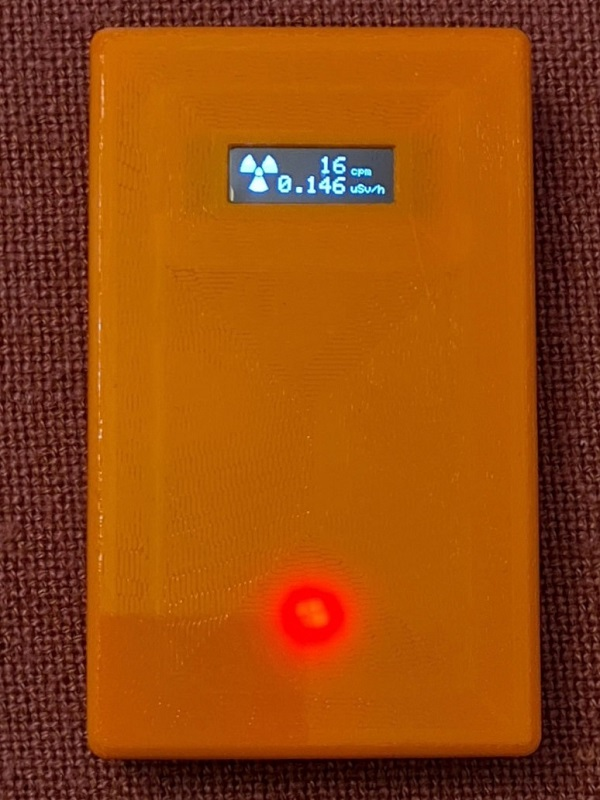

# DIY Geiger-Counter

This is a DYI Geiger Counter with rechargable Akku and OLED-Display for overall costst of roundabout 45€.

----------

Based on an inexpensive kit from China, a Geiger counter for monitoring the radioactive ambient radiation was created.
The required electronic components are listed below. I provide the appropriate housing as a model for 3D printing on Thingiverse.
After completion, we recommend calibrating the device using a professional measuring device by adjusting the correction factor in line 48 of DIY_Geiger.ino.

## Software 
Because the NodeMCU is Arduino-compatible it can be programmed with any IDE for Arduino. Beside the Code-file propagated here there are some Standard-Arduino-libraries to use:

* Adafruit_GFX_Library
* Adafruit_SSD1306
* ESP8266WiFi (to disable WiFi for power save)
* SPI
* Wire

## Hardware 
Here a list of necessary hardware components with links where to buy

* Geiger Tube Kit [Mythtiger](https://www.aliexpress.com/item/1005004074451147.html) (jack socket removed)
* 0.91" OLED Display White [SSD1306 ](https://www.aliexpress.com/item/32879702750.html) 
* NodeMCU [ESP8266-12E](https://www.aliexpress.com/item/33010335367.html)
* 3,7V-Akku [405060](https://www.aliexpress.com/item/1005003746052381.html)
* Power Bank Controller [134N3P](https://www.aliexpress.com/item/33005568006.html) (USB-A-socket removed)
* Case [DIY_Geiger](https://www.thingiverse.com/thing:5507322) (must be printed by yourself)

